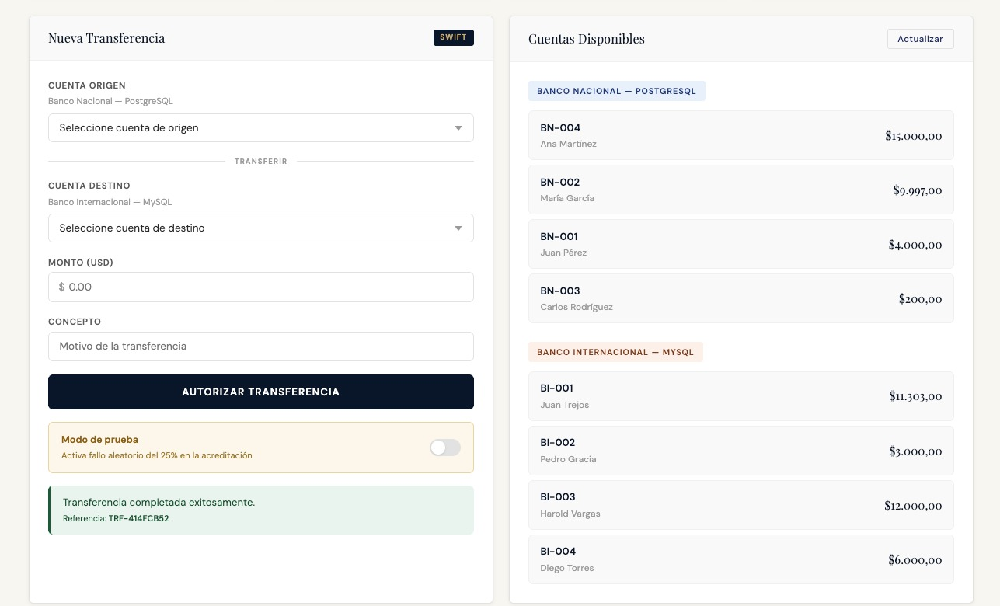
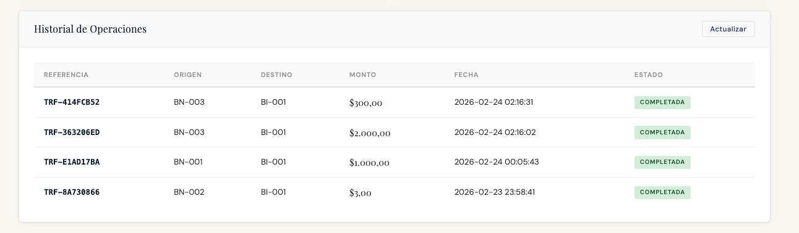
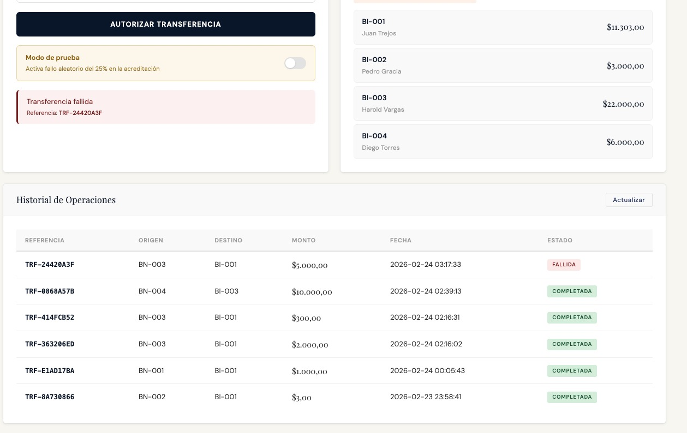
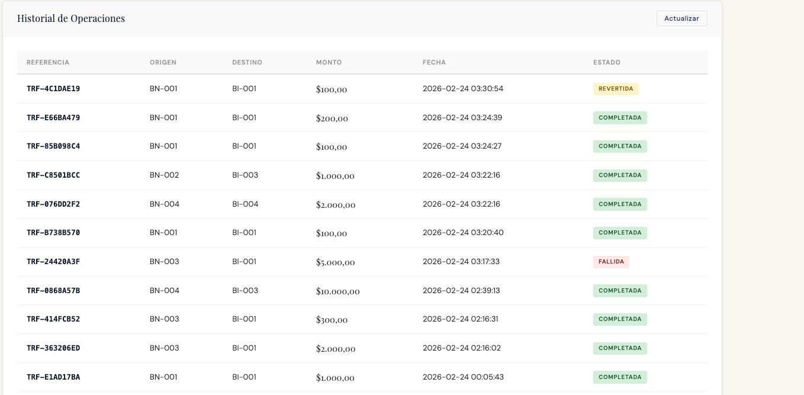
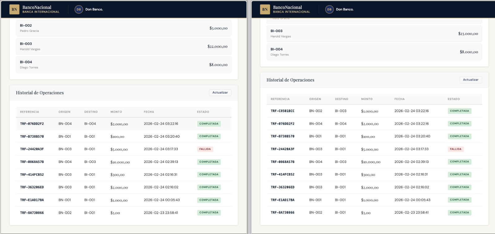

# Taller Práctico: Transacciones Distribuidas
## PostgreSQL + MySQL con Patrón SAGA Orquestado

**Pontificia Universidad Javeriana**  
Facultad de Ingeniería — Departamento de Ingeniería de Sistemas  
Arquitectura de Software (3384) — Período 2026-10

Nombres de los Integrantes
Harold Alejandro Vargas Martínez

Juan Martin Trejos

Juan Sebastian Forero Moreno

Wilson David Sanchez Prieto

---

## Tabla de Contenidos

1. Instrucciones de Instalación
2. Arquitectura Implementada
3. Patrón SAGA — Investigación
4. Decisiones de Diseño Justificadas
5. Escenarios de Prueba
6. Criterios de Evaluación
7. Reflexión Final

---

## Instrucciones de Instalación

Para correr el proyecto se necesita tener Docker Desktop instalado y corriendo. Los puertos 8080, 5432 y 3307 deben estar disponibles en la máquina.

> **Nota:** Maven va a intentar compilar usando la versión de Java instalada por defecto. En este caso se usó Java 17 vía Homebrew (`brew install maven`). Si hay otra versión instalada (Java 21, 25, etc.), la compilación local puede fallar. Para evitar este problema, el Dockerfile ya compila internamente con Java 17, así que basta con usar Docker directamente.

**Paso 1 — Descomprimir o clonar el proyecto:**
```bash
git clone <url-repositorio>
cd taller-javeriana
```

**Paso 2 — Levantar todo con Docker:**
```bash
docker-compose up -d
```

Este comando construye la imagen de la aplicación compilando con Java 17 internamente, levanta PostgreSQL, MySQL y el servidor Spring Boot. La primera vez tarda unos 2-3 minutos mientras descarga las imágenes base.

**Paso 3 — Verificar que los contenedores estén corriendo:**
```bash
docker-compose ps
```

Debe aparecer:
```
banco_nacional_db       running   0.0.0.0:5432->5432/tcp
banco_internacional_db  running   0.0.0.0:3307->3306/tcp
transferencias_app      running   0.0.0.0:8080->8080/tcp
```

**Paso 4 — Abrir la aplicación en el navegador:**
```
http://localhost:8080
```

**Para detener el sistema:**
```bash
docker-compose down        # detiene sin borrar datos
docker-compose down -v     # detiene y borra los datos de las bases de datos
```

> Si el puerto 3306 llega a estar ocupado por uso por una instalación local de MySQL, el proyecto va a usar el puerto 3307 externamente para evitar conflictos. La aplicación internamente sigue usando 3306 sin cambios.

---

## Arquitectura Implementada

El proyecto sigue una arquitectura en capas, que es un patrón que divide la aplicación en niveles horizontales donde cada uno tiene una responsabilidad específica. Esto hace que el código sea más fácil de mantener, entender y escalar porque cada capa solo se comunica con la que tiene debajo.

Las capas del proyecto son:

- **Presentación** (`static/`): el frontend en HTML, CSS y JavaScript que el usuario ve en el navegador web.
- **Controlador** (`controller/`): recibe las peticiones HTTP y las delega al servicio correspondiente
- **Servicio** (`service/`): contiene toda la lógica de negocio, incluyendo el orquestador del patrón SAGA
- **Repositorio** (`repository/`): se encarga de comunicarse con las bases de datos usando Spring Data JPA
- **Modelo** (`model/`): define las entidades que se mapean a las tablas de la base de datos

### Componentes del Sistema

```
[NAVEGADOR]
     |
     | HTTP :8080
     v
[Spring Boot — API REST + Orquestador SAGA]
     |
     |──────────────────────────────────|
     |                                  |
     v                                  v
[PostgreSQL :5432]              [MySQL :3306]
 Banco Nacional                  Banco Internacional
 - cuenta                        - cuenta
 - movimiento                    - movimiento
 - transferencia (log SAGA)
```

Hay dos bases de datos corriendo en paralelo en contenedores separados. Spring Boot se conecta a ambas al mismo tiempo usando dos `DataSource` configurados independientemente, uno para PostgreSQL y otro para MySQL. Esto es lo que hace necesario el patrón SAGA, ya que no es posible hacer una sola transacción que abarque las dos bases de datos.

### Tecnologías

| Componente | Tecnología |
|---|---|
| Backend | Java 17 + Spring Boot 3 |
| Base de Datos 1 | PostgreSQL 15 |
| Base de Datos 2 | MySQL 8 |
| Frontend | HTML + CSS + JavaScript |
| Contenedores | Docker + Docker Compose |
| ORM | Spring Data JPA + Hibernate |

### Estructura del Proyecto

```
src/main/java/co/edu/javeriana/transferencias/
├── config/
│   ├── BancoNacionalDataSourceConfig.java
│   └── BancoInternacionalDataSourceConfig.java
├── model/
│   ├── Cuenta.java
│   ├── Movimiento.java
│   ├── Transferencia.java
│   └── EstadoTransferencia.java
├── repository/
│   ├── nacional/
│   │   ├── CuentaNacionalRepository.java       # @Lock PESSIMISTIC_WRITE
│   │   ├── MovimientoNacionalRepository.java
│   │   └── TransferenciaNacionalRepository.java
│   └── internacional/
│       ├── CuentaInternacionalRepository.java  # @Lock PESSIMISTIC_WRITE
│       └── MovimientoInternacionalRepository.java
├── service/
│   ├── BancoNacionalService.java               # debitar() + revertirDebito()
│   ├── BancoInternacionalService.java          # acreditar() + simulación fallos
│   ├── SagaLogService.java                     # Persiste estados (REQUIRES_NEW)
│   └── TransferenciaService.java              # Orquestador SAGA
├── controller/
│   └── TransferenciaController.java
└── dto/
    └── TransferenciaDTO.java
```

---

## Patrón SAGA — Investigación

### ¿Qué es el Patrón SAGA?

Una saga consiste en una secuencia de transacciones locales. Cada transacción local de una saga actualiza la base de datos y desencadena la siguiente transacción local. Si se produce un error en una transacción, la saga ejecuta transacciones de compensación para revertir los cambios en la base de datos realizados por las transacciones anteriores.

Esta secuencia de transacciones locales ayuda a lograr un flujo de trabajo empresarial al utilizar los principios de continuidad y compensación. El principio de continuación decide la recuperación anticipada del flujo de trabajo, mientras que el principio de compensación decide la recuperación hacia atrás. Si se produce un error en la actualización en algún paso de la transacción, la saga publica un evento para continuar (para volver a intentar la transacción) o como compensación (para volver al estado anterior de los datos). Esto garantiza que la integridad de los datos se mantenga y sea coherente en todos los almacenes de datos.

Por ejemplo, cuando un usuario compra un libro en una tienda online, el proceso consiste en una secuencia de transacciones, como la creación de un pedido, la actualización del inventario, el pago y el envío, que representa un flujo de trabajo empresarial. Para completar este flujo de trabajo, la arquitectura distribuida emite una secuencia de transacciones locales para crear un pedido en la base de datos de pedidos, actualizar la base de datos de inventario y actualizar la base de datos de pagos. Cuando el proceso se realiza correctamente, estas transacciones se invocan secuencialmente para completar el flujo de trabajo empresarial, como se muestra en el siguiente diagrama. Sin embargo, si se produce un error en alguna de estas transacciones locales, el sistema debería poder decidir cuál es el siguiente paso adecuado, es decir, una recuperación hacia adelante o hacia atrás.

### Casos de Uso

- Transferencias bancarias entre sistemas con diferentes motores de base de datos
- Pedidos en e-commerce: reservar inventario + cobrar + enviar
- Reservas de viajes: vuelo + hotel + auto en sistemas separados
- Onboarding de usuarios en microservicios
- Integraciones B2B entre sistemas legacy con diferentes tecnologías

### Componentes del Patrón

| Componente | Descripción |
|---|---|
| Transacciones locales | Cada servicio ejecuta su propia transacción ACID en su BD |
| Transacciones compensatorias | Operaciones inversas para deshacer cambios ante fallos |
| Orquestador | Servicio central que coordina el flujo |
| Log de estado | Registro persistente del progreso de la transacción distribuida |

### SAGA Coreografiado vs SAGA Orquestado

| Característica | Coreografiado | Orquestado |
|---|---|---|
| Coordinación | Eventos distribuidos entre servicios | Servicio central orquestador |
| Acoplamiento | Bajo entre servicios | Servicios dependen del orquestador |
| Visibilidad | Difícil rastrear el flujo | Flujo centralizado y trazable |
| Complejidad | Alta para flujos complejos | Más simple de implementar |
| Infraestructura | Requiere broker (RabbitMQ, Kafka) | No requiere broker |
| Uso ideal | Microservicios independientes | Flujos secuenciales bien definidos |

Este taller implementa **SAGA Orquestado** porque el flujo es secuencial (débito → crédito), no requiere infraestructura de mensajería adicional y el flujo es centralizado y trazable.

### Flujo del SAGA Implementado

| Paso | Acción | Si falla... |
|---|---|---|
| 0 | Crear registro con estado `INICIADA` | Marcar `FALLIDA` |
| 1 | Debitar en Banco Nacional (PostgreSQL) | Marcar `FALLIDA` |
| 2 | Actualizar estado a `DEBITO_COMPLETADO` | — |
| 3 | Acreditar en Banco Internacional (MySQL) | COMPENSAR: revertir débito |
| 4 | Actualizar estado a `CREDITO_COMPLETADO` | — |
| 5 | Actualizar estado a `COMPLETADA` | — |

### Gestión de Estados

```
INICIADA
    |
    |-- fallo débito --> FALLIDA
    |
DEBITO_COMPLETADO
    |
    |-- fallo crédito --> [compensación] --> REVERTIDA
    |
CREDITO_COMPLETADO
    |
COMPLETADA
```

---

## Decisiones de Diseño Justificadas

### ¿Por qué no usar XA/2PC?

PostgreSQL y MySQL tienen implementaciones XA incompatibles. Configurar un coordinador confiable (Atomikos, Bitronix) requiere infraestructura compleja, genera alto overhead de latencia y es frágil ante fallos de red. SAGA ofrece una alternativa más robusta y práctica.

### ¿Por qué SAGA Orquestado?

El flujo es estrictamente secuencial: primero debitar, luego acreditar. El SAGA Orquestado permite debugging centralizado, no requiere broker de mensajes y es apropiado para flujos de negocio bien definidos.

### ¿Por qué locks pesimistas?

`@Lock(LockModeType.PESSIMISTIC_WRITE)` previene race conditions cuando transferencias concurrentes operan sobre la misma cuenta. Sin locks, dos transferencias podrían leer el mismo saldo y ambas proceder, generando inconsistencias.

### SagaLogService con REQUIRES_NEW

Cada cambio de estado se persiste en una transacción independiente (`Propagation.REQUIRES_NEW`). Esto garantiza que si la transacción principal hace rollback, el estado `FALLIDA` o `REVERTIDA` queda guardado correctamente para auditoría.

---

## Escenarios de Prueba

### Escenario 1 — Transferencia Exitosa

**Datos:** BN-001 → BI-001, $100  
**Resultado:** Estado `COMPLETADA`, saldos actualizados en ambas bases de datos





---

### Escenario 2 — Saldo Insuficiente

**Datos:** BN-003 → BI-001, $5.000 (BN-003 tiene saldo de $200)  
**Resultado:** Estado `FALLIDA` — Falla en paso 1, sin cambios en saldos



---

### Escenario 3 — Fallo Simulado con Compensación

**Datos:** Activar toggle "Modo de prueba" + realizar transferencia  
**Resultado:** Estado `REVERTIDA` — Débito compensado, saldo origen restaurado




---

### Escenario 4 — Concurrencia con Locks Pesimistas

**Datos:** 2 transferencias simultáneas desde diferentes cuentas en 2 pestañas  
**Resultado:** Ambas procesadas correctamente — Los locks pesimistas previenen race conditions




---

## Reflexión Final

Este taller nos permitió confrontar uno de los desafíos más frecuentes en arquitecturas de software empresarial: mantener consistencia entre sistemas distribuidos con diferentes tecnologías de almacenamiento. La restricción de no poder usar transacciones XA/2PC entre PostgreSQL y MySQL no es una limitación artificial del enunciado, sino una realidad del mundo real que equipos de desarrollo enfrentan constantemente al integrar sistemas heterogéneos.

La implementación del patrón SAGA evidenció el concepto de consistencia eventual: el sistema no garantiza que todos los nodos estén sincronizados en el mismo instante, sino que eventualmente alcanzarán un estado consistente. Este paradigma representa un trade-off deliberado entre consistencia estricta y disponibilidad. En el contexto bancario, existe una ventana de tiempo —entre el débito y el crédito— donde el dinero no está en ninguna de las dos cuentas, lo cual requiere mecanismos de compensación robustos para manejar fallos en ese intervalo.

La diferencia entre SAGA Orquestado y Coreografiado resultó especialmente reveladora. El orquestador centraliza la lógica del flujo y simplifica el debugging, pero crea un acoplamiento con el servicio central. El coreografiado distribuye la responsabilidad entre los servicios mediante eventos, logrando mayor autonomía a costa de mayor complejidad para rastrear el flujo completo. La elección depende del contexto: equipos pequeños y flujos secuenciales favorecen la orquestación; arquitecturas de microservicios a escala favorecen la coreografía.

Los locks pesimistas demostraron ser esenciales para garantizar la integridad en escenarios de concurrencia. Sin ellos, dos transferencias simultáneas desde la misma cuenta podrían ambas leer el mismo saldo disponible y proceder, generando un débito duplicado. Esta lección trasciende el patrón SAGA y aplica a cualquier sistema donde múltiples procesos compiten por los mismos recursos.

En conclusión, este taller simuló con precisión problemas reales de arquitecturas de microservicios, integraciones B2B y sistemas cloud multi-región. Las lecciones sobre consistencia eventual, compensación de transacciones y gestión de estado distribuido son directamente aplicables a entornos de producción y constituyen fundamentos esenciales del arquitecto de software moderno.
